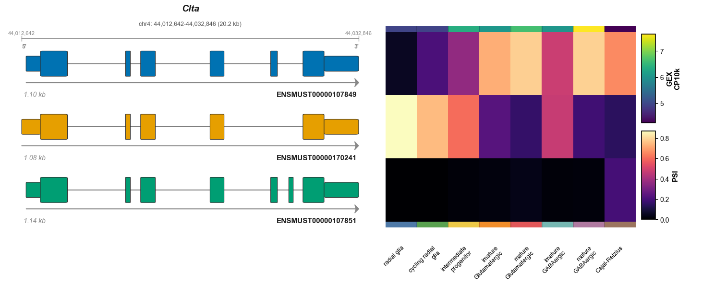
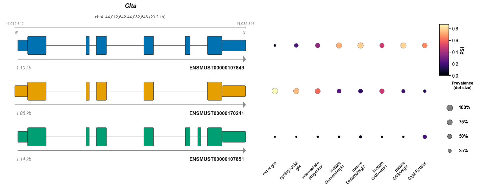
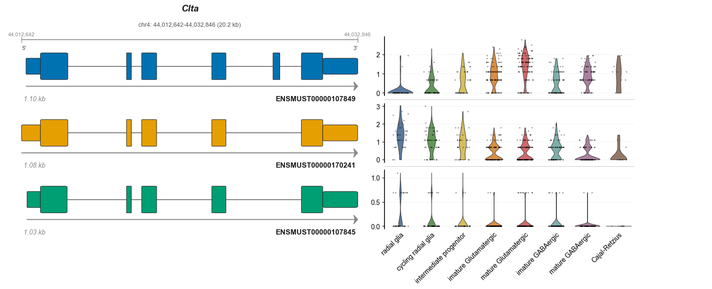
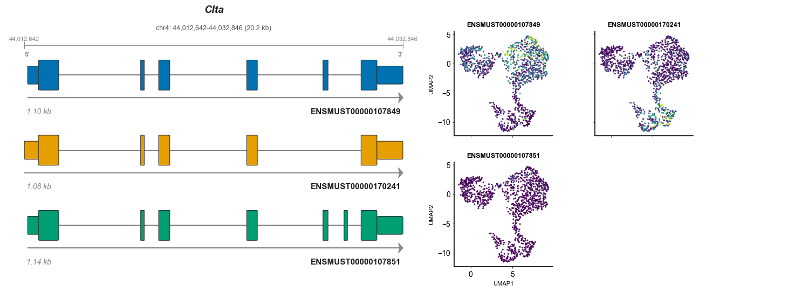
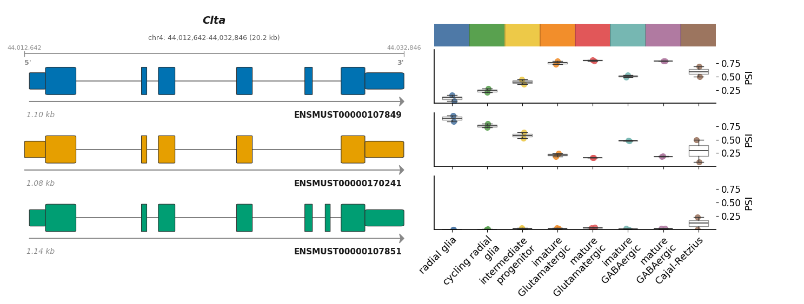
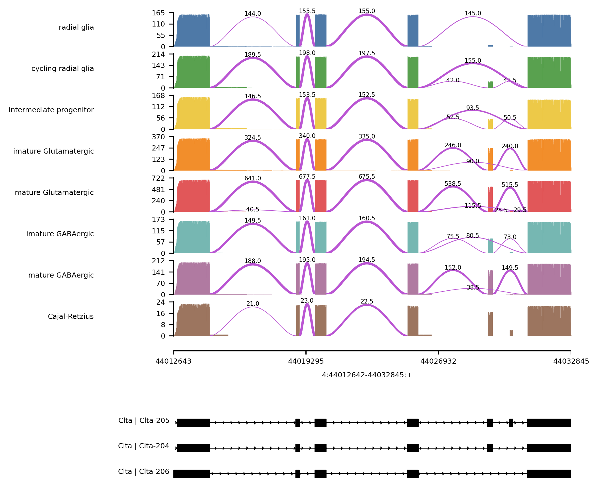
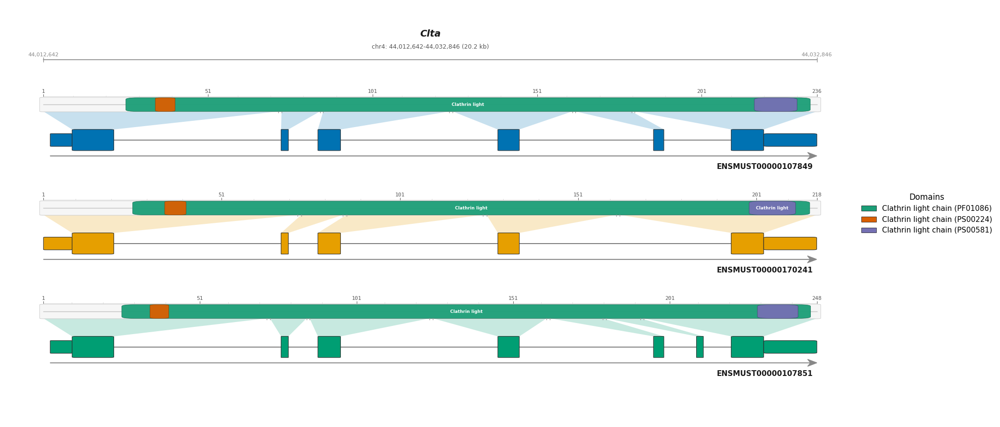
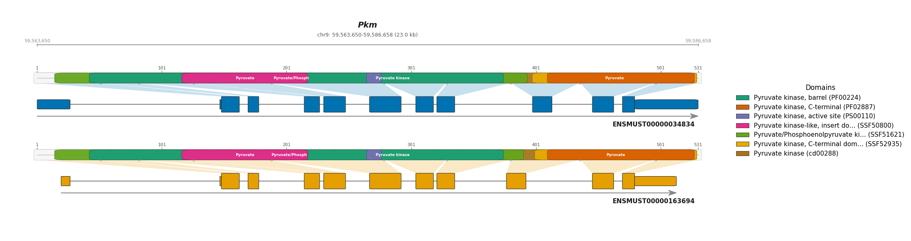

# Allos

> An isoform-resolution single-cell RNA-seq toolkit.


[](https://opensource.org/licenses/Apache-2.0) 

Single-cell RNA sequencing (scRNA-seq) has revolutionized our understanding of cellular diversity by allowing the study of gene expression at the individual cell level. However, traditional methods of quantification obscure the most fine-grained transcriptional layer — the individual transcripts at sequence-level resolution — in favor of gene-level binning.

Long-read sequencing technologies (Oxford Nanopore, PacBio) overcome this limitation by producing reads that span entire transcripts, enabling isoform-resolved single-cell and spatial transcriptomics. **Allos** brings this isoform-level analysis into the familiar scverse/AnnData ecosystem, wrapping around Scanpy to provide preprocessing, differential isoform usage screening, publication-quality visualisation, and protein domain annotation.

For the full method description, see McAndrew *et al.*, 2026 ([bioRxiv 10.64898/2026.03.24.713944](https://www.biorxiv.org/content/10.64898/2026.03.24.713944v1)).

## Install

```sh
pip install allos
```

Or install from source:

```sh
git clone https://github.com/cobioda/allos
cd allos
pip install -e .
```

## Quick start

Allos ships with a bundled mouse E18 brain dataset (Sicelore, ~1,100 cells, two technical replicates) for testing. The examples below show the current API — see `tutorial_notebooks/01_single_cell_tutorial.ipynb` for the full worked practical.

### Load data and preprocess

```python
import scanpy as sc
import allos.preprocessing as pp
from allos.transcript_data import TranscriptData
from allos.transcript_plots import TranscriptPlots

adata = pp.process_mouse_data()
td = TranscriptData("Mus_musculus.GRCm39.109.gtf.gz")

adata = pp.filter_transcripts_by_abundance(adata, threshold_pct=2)
```

### Differential isoform usage (SwitchSearch)

```python
from allos.switch_search import SwitchSearch

ss = SwitchSearch(adata, n_jobs=4)
diu_results = ss.find_switches_chi2(
    primary_col='cell_type',
    fdr=0.10,
    return_transcript_metrics=True,
)
```

### Volcano plots

```python
from allos.switch_search import volcano_grid

volcano_grid(
    diu_results,
    n_cols=4,
    top_n=5,
    eff_cutoff=0.15,
    fdr_cutoff=0.05,
    abbrev={"cycling radial glia": "Cyc. RG", "radial glia": "RG", ...},
)
```

### Composed figures

Allos **composed plots** pair transcript exon structures (left) with quantitative expression panels (right) in a single publication-ready figure. Seven plot types are available:

#### Heatmap

```python
from allos.composed_plots import plot_isoform_heatmap_composed

plot_isoform_heatmap_composed(
    transcript_data=td, adata=adata, gene_id='Clta',
    group_col='cell_type', top_n=3,
    add_group_color_band=True, add_gex_band=True,
)
```



#### Dotplot

```python
from allos.composed_plots import plot_isoform_dot_composed

plot_isoform_dot_composed(
    transcript_data=td, adata=adata, gene_id='Clta',
    group_col='cell_type', top_n=3,
)
```



#### Violin

```python
from allos.composed_plots import plot_isoform_violin_composed

plot_isoform_violin_composed(
    transcript_data=td, adata=adata, gene_id='Clta',
    group_col='cell_type', top_n=3,
)
```



#### Stacked bar

```python
from allos.composed_plots import plot_isoform_stacked_bar_composed

plot_isoform_stacked_bar_composed(
    transcript_data=td, adata=adata, gene_id='Clta',
    group_col='cell_type', top_n=3,
)
```


#### UMAP

```python
from allos.composed_plots import plot_isoform_umap_composed

plot_isoform_umap_composed(
    transcript_data=td, adata=adata, gene_id='Clta',
    group_col='cell_type', top_n=3,
)
```



#### Density

```python
from allos.composed_plots import plot_isoform_density_composed

plot_isoform_density_composed(
    transcript_data=td, adata=adata, gene_id='Clta',
    group_col='cell_type', top_n=3,
)
```


#### Replicate concordance

```python
from allos.composed_plots import plot_isoform_replicates_composed

plot_isoform_replicates_composed(
    transcript_data=td, adata=adata, gene_id='Clta',
    group_col='cell_type', replicate_col='batch', top_n=3,
    add_group_color_band=True,
)
```



### Read-level coverage

```python
from allos.coverage_plots import plot_gene_coverage

plot_gene_coverage(
    adata, transcript_data=td, gene='Clta',
    groupby='cell_type', bam_paths={'0': 'rep1.bam', '1': 'rep2.bam'},
    bam_column='batch', gtf_file='annotation.gtf.gz', top_n=3,
)
```



### Protein domain overlay

```python
from allos.protein_data import ProteinData
from allos.protein_plots import ProteinPlots

pd = ProteinData(td, provider="ensembl")
pplot = ProteinPlots(transcript_data=td, protein_data=pd)

fig = pplot.draw_gene_with_protein_domains(
    gene="Clta", adata=adata, top_n=3,
    id_prefixes=["PF", "SM", "PS", "cd", "SS"], max_domains=8,
)
```





## Module overview

| Module | Purpose |
|--------|---------|
| `allos.preprocessing` | Data loading, QC, isoform filtering, gene-matrix conversion |
| `allos.switch_search` | SwitchSearch DIU screen, volcano plots, effect-size metrics |
| `allos.transcript_data` | GTF/GFF parsing, exon/CDS coordinate lookup |
| `allos.transcript_plots` | Transcript structure glyphs with intron compression |
| `allos.composed_plots` | Seven composed plot types pairing structure with expression |
| `allos.coverage_plots` | Per-cell-type BAM coverage with splice junction arcs |
| `allos.protein_data` | Ensembl/InterPro domain retrieval and AA→genomic mapping |
| `allos.protein_plots` | Linearised protein track overlay on transcript structures |
| `allos.color_palette` | Curated colour palettes for publication figures |

## Tutorials

See `tutorial_notebooks/` for complete worked examples:

- **01_single_cell_tutorial.ipynb** — end-to-end workflow: data loading, QC, marker validation, Leiden clustering, DIU with SwitchSearch, all 7 composed plot types, read-level coverage, replicate concordance, protein domain overlay, and exercises.

## License

Apache 2.0 License | © 2024 onwards, Anna Diamant, Eamon McAndrew, Université Côte d'Azur
