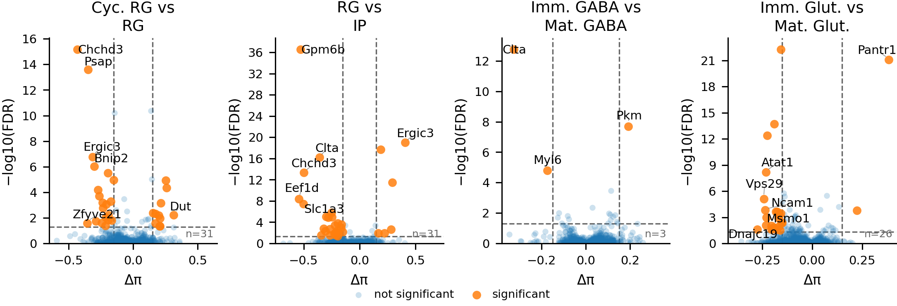
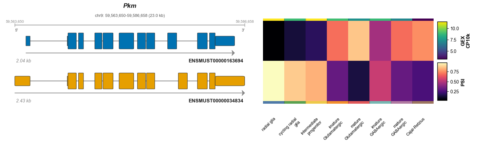
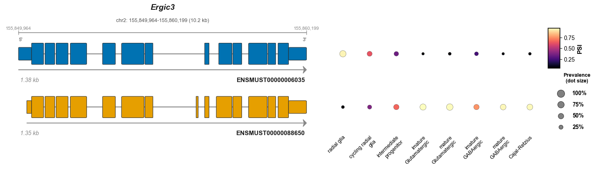
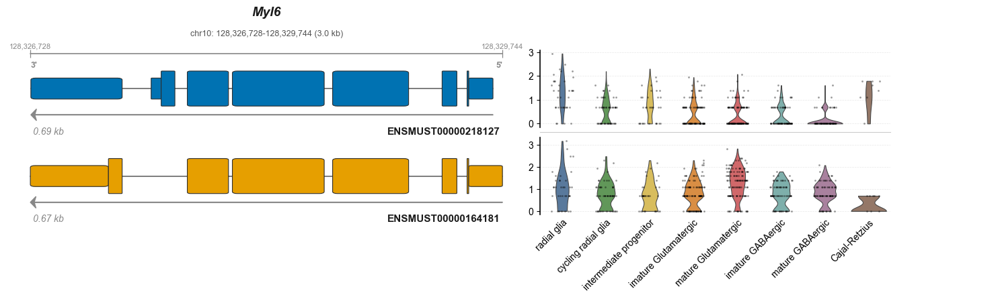
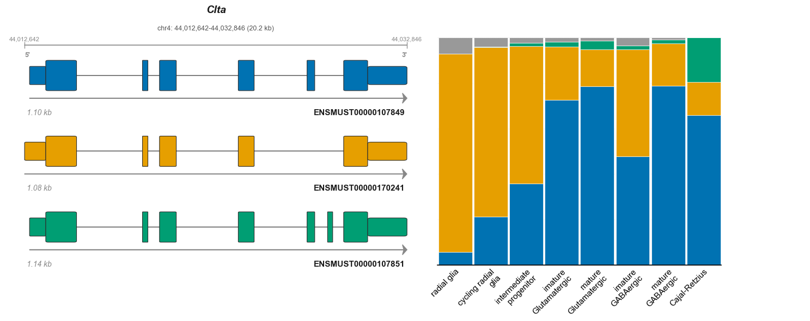
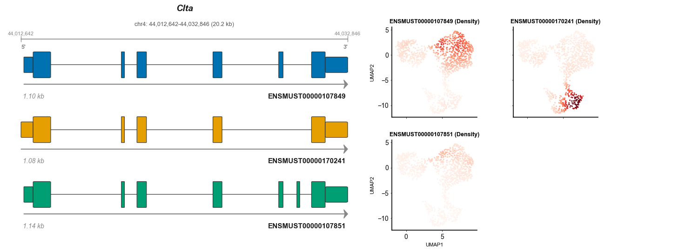
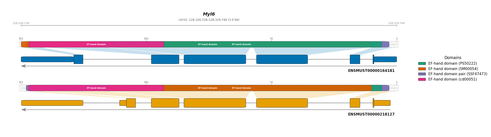
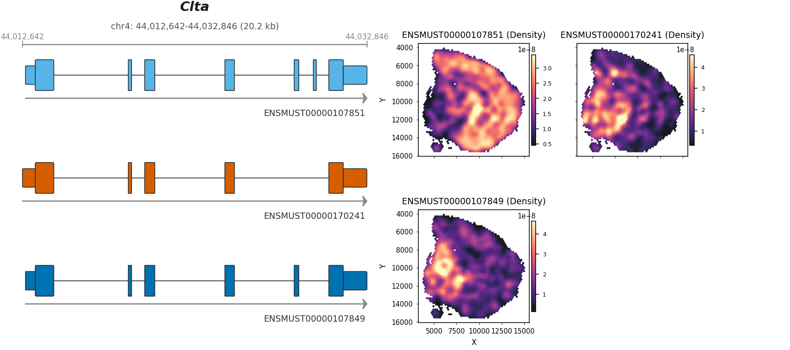
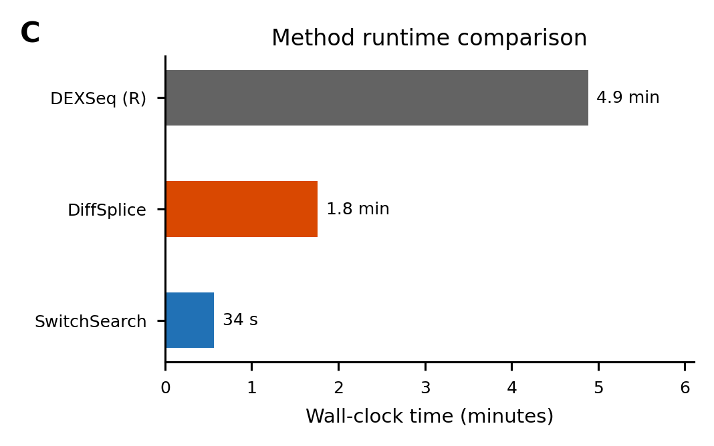

<p align="center">
  
</p>

<h2 align="center">An integrated Python toolkit for isoform-level single-cell and spatial transcriptomics</h2>

<p align="center">
  <a href="https://opensource.org/licenses/Apache-2.0"></a>
  <a href="https://pypi.org/project/allos/"></a>
  <a href="https://github.com/cobioda/allos/actions/workflows/deploy.yaml"></a>
  <a href="https://colab.research.google.com/github/cobioda/allos/blob/main/nbs/index.ipynb"></a>
</p>

---

Most single-cell and spatial transcriptomics pipelines collapse transcript diversity into a single count per gene, obscuring alternative splicing and isoform usage. As long-read sequencing now routinely recovers full-length transcripts from single cells and spatially barcoded tissues, **Allos** provides the computational framework to analyse them.

Allos is a Python toolkit built natively around [AnnData](https://anndata.readthedocs.io) and the [scverse](https://scverse.org) ecosystem. It provides a complete end-to-end environment for isoform-resolved analysis — from QC and preprocessing through differential isoform usage screening, to structure-aware visualisation, coverage-based validation, and protein-level interpretation — across both single-cell and spatial data.

For the full method description, see McAndrew *et al.*, 2026 ([bioRxiv 10.64898/2026.03.24.713944](https://www.biorxiv.org/content/10.64898/2026.03.24.713944v1)).

---

## SwitchSearch — transcriptome-wide isoform switch screening

`SwitchSearch` screens every gene with ≥2 expressed isoforms across all pairwise cell-type contrasts simultaneously, using a χ² contingency test on isoform count vectors. Results are ranked by adjusted p-value and a Δπ effect size — the summed magnitude of PSI change across the two most strongly shifting isoforms — giving an immediate ranked list of candidate switches.

The screen completes in **~34 seconds** on a typical single-cell dataset, making it practical as a first-pass discovery step before committing to more computationally intensive pseudobulk methods.

```python
from allos.switch_search import SwitchSearch, volcano_grid

ss = SwitchSearch(adata, n_jobs=4)
results = ss.find_switches_chi2(primary_col="cell_type", fdr=0.10)

volcano_grid(results, n_cols=4, eff_cutoff=0.15, fdr_cutoff=0.05, abbrev=ABBREV)
```

<p align="center">
  
  <br/><sub><em>Representative pairwise contrasts — E18 mouse brain. Orange: |Δπ| ≥ 0.15 & FDR < 0.05.</em></sub>
</p>

---

## Composed plots — transcript structure meets quantification

The centrepiece of Allos is the **composed plot**: transcript structures rendered to genomic scale, aligned directly with quantitative isoform usage panels. Seven formats are available to match different expression patterns and data densities.

### Heatmap

Best for genes with strong, consistent switching across many groups. Summarises mean PSI for all cell types with optional GEX and group colour bands.

```python
from allos.composed_plots import plot_isoform_heatmap_composed

plot_isoform_heatmap_composed(
    transcript_data=td, adata=adata, gene_id='Pkm',
    group_col='cell_type', top_n=2,
    add_group_color_band=True, add_gex_band=True,
)
```

<p align="center">
  
  <br/><sub><em>Pkm — the canonical M1/M2 metabolic switch during neuronal maturation.</em></sub>
</p>

### Dotplot

Encodes mean PSI as colour and prevalence (% of cells expressing the isoform) as dot size — distinguishes widespread shifts from those driven by a few cells.

```python
from allos.composed_plots import plot_isoform_dot_composed

plot_isoform_dot_composed(
    transcript_data=td, adata=adata, gene_id='Ergic3',
    group_col='cell_type', top_n=3,
)
```

<p align="center">
  
  <br/><sub><em>Ergic3 — exon-excluding isoform dominates in radial glia; exon-including isoform prevails in neurons.</em></sub>
</p>

### Violin

Shows the full per-cell expression distribution, capturing cell-type-restricted isoform specificity even at low expression levels.

```python
from allos.composed_plots import plot_isoform_violin_composed

plot_isoform_violin_composed(
    transcript_data=td, adata=adata, gene_id='Myl6',
    group_col='cell_type', top_n=3,
)
```

<p align="center">
  
  <br/><sub><em>Myl6 — cell-type-restricted isoform specificity in the regulatory light chain.</em></sub>
</p>

### Stacked bar

Displays isoform proportions as stacked bars per group — an immediate overview of how the "pie" is split across isoforms.

```python
from allos.composed_plots import plot_isoform_stacked_bar_composed

plot_isoform_stacked_bar_composed(
    transcript_data=td, adata=adata, gene_id='Clta',
    group_col='cell_type', top_n=3,
)
```

<p align="center">
  
  <br/><sub><em>Clta — isoform proportions shift markedly between progenitors and mature neurons.</em></sub>
</p>

### UMAP

Overlays per-isoform expression on the UMAP manifold — shows which cells express which isoform.

```python
from allos.composed_plots import plot_isoform_umap_composed

plot_isoform_umap_composed(
    transcript_data=td, adata=adata, gene_id='Clta',
    group_col='cell_type', top_n=3,
)
```

<p align="center">
  
</p>

### Density

KDE-smoothed isoform expression on the UMAP — highlights continuous gradients and spatial patterns.

```python
from allos.composed_plots import plot_isoform_density_composed

plot_isoform_density_composed(
    transcript_data=td, adata=adata, gene_id='Clta',
    group_col='cell_type', top_n=3,
)
```

<p align="center">
  
</p>

### Replicate concordance

Per-replicate PSI values with box overlay — checks whether isoform proportions are reproducible across batches.

```python
from allos.composed_plots import plot_isoform_replicates_composed

plot_isoform_replicates_composed(
    transcript_data=td, adata=adata, gene_id='Clta',
    group_col='cell_type', replicate_col='batch', top_n=3,
    add_group_color_band=True,
)
```

<p align="center">
  
</p>

---

## Coverage plots — read-level validation

Coverage plots display mean read depth and splice junction usage per cell type alongside transcript models — a genome-browser–style view without leaving Python.

```python
from allos.coverage_plots import plot_gene_coverage

plot_gene_coverage(
    adata, transcript_data=td, gene='Clta',
    groupby='cell_type', bam_paths=bam_paths,
    bam_column='batch', gtf_file='annotation.gtf.gz', top_n=3,
)
```

<p align="center">
  
</p>

---

## Protein domain overlay

Fetch protein domains from Ensembl or InterPro and overlay them on transcript exon structures — linking splicing changes to functional protein regions.

```python
from allos.protein_data import ProteinData
from allos.protein_plots import ProteinPlots

pd = ProteinData(td, provider="ensembl")
pplot = ProteinPlots(transcript_data=td, protein_data=pd)

fig = pplot.draw_gene_with_protein_domains(
    gene="Myl6", adata=adata, top_n=3,
    id_prefixes=["PF", "SM", "PS"], max_domains=8,
)
```

<p align="center">
  
  <br/><sub><em>Myl6 — protein domains mapped onto the three most expressed isoforms, showing the alternative EF-hand region.</em></sub>
</p>

---

## Spatial isoform resolution

Allos visualises isoform usage directly on tissue coordinates, combining transcript structure diagrams with KDE-smoothed density maps or per-spot expression plots across spatially barcoded long-read datasets.

<p align="center">
  
  <br/>
  <em>Three Clta isoforms with transcript structures and KDE-smoothed spatial density — mouse coronal brain section (SiT dataset).</em>
</p>

---

## Features

**Data & Platforms**
- Supports transcript × cell or spot count matrices from **Oxford Nanopore**, **PacBio**, **Smart-seq2**, **Illumina**, and spatial long-read platforms (e.g. Visium + ONT)
- Integrates GTF/GFF and transcript FASTA annotations via the `TranscriptData` module
- Fully compatible with Scanpy, Seurat-derived annotations, and the broader scverse ecosystem

**Analysis**
- **SwitchSearch** — χ²-based DIU screen across all pairwise or one-vs-rest contrasts; completes in ~34 s vs. 1.8 min (DiffSplice) and 4.9 min (DEXSeq)
- **Pseudobulk DIU** — replicate-aware testing via [edgePython](https://github.com/pachterlab/edgePython) + DiffSplice for rigorous follow-up
- Isoform proportion estimation with pseudobulk, Dirichlet-smoothed, or per-cell estimators; ΔPSI and Δπ effect sizes

**Visualisation**
- **Composed plots** — seven formats: heatmap, dotplot, violin, stacked bar, UMAP, density, and replicate concordance — each pairing transcript structures with quantitative panels
- **Coverage plots** — read depth and splice junction tracks stratified by cell type or condition
- **Protein domain overlay** — Ensembl/InterPro domain annotations mapped onto transcript exon structures with linearised protein tracks
- **Volcano plots** — manuscript-quality Δπ-vs-FDR panels with adjustText labels, rasterised scatter, and grid tiling
- **Coordinate plots** — UMAP or spatial tissue overlays; KDE-smoothed density maps for sparse data
- **QC plots** — isoform-per-gene distributions, transcript lengths, biotype breakdowns

---

## Installation

```sh
git clone https://github.com/cobioda/allos
cd allos
pip install -e .
```

---

## SwitchSearch performance

<p align="center">
  
</p>

SwitchSearch is designed as a rapid first-pass exploratory screen — analogous to marker gene detection in Scanpy — and is complemented by pseudobulk methods (DiffSplice via edgePython, DEXSeq) for rigorous confirmatory analysis, both accessible within Allos.

---

## Modules

| Module | Description |
|---|---|
| `allos.preprocessing` | Load data, QC, normalize, transfer annotations, collapse transcripts → genes |
| `allos.switch_search` | `SwitchSearch` — χ²-based DIU screening; volcano plots; ΔPSI and Δπ effect sizes |
| `allos.transcript_data` | `TranscriptData` — GTF/GFF parsing, exon/CDS retrieval, sequence extraction |
| `allos.transcript_plots` | `TranscriptPlots` — transcript structure glyphs with intron compression |
| `allos.composed_plots` | Seven composed plot types (heatmap, dotplot, violin, stacked bar, UMAP, density, replicates) |
| `allos.coverage_plots` | Per-cell-type BAM coverage with splice junction arcs |
| `allos.protein_data` | Ensembl/InterPro domain retrieval and AA→genomic mapping |
| `allos.protein_plots` | Linearised protein track overlay on transcript structures |
| `allos.visuals` | UMAP/spatial overlays, KDE density maps |
| `allos.color_palette` | Curated colour palettes for publication figures |

---

## Tutorials

Complete worked examples in [`tutorial_notebooks/`](tutorial_notebooks/):

| # | Tutorial | Topics covered |
|:-:|---|---|
| 1 | [**Single-cell isoform analysis**](tutorial_notebooks/01_single_cell_tutorial.ipynb) | Data loading, QC, marker validation, Leiden clustering, DIU with SwitchSearch, volcano plots, all 7 composed plot types, read-level coverage, replicate concordance, protein domain overlay, exercises |

> More tutorials coming soon — spatial transcriptomics, pseudobulk DIU, and custom annotation workflows.

---

## Citation

If you use Allos in your research, please cite:

> McAndrew E., Diamant A., Barbry P., Vassaux G., Lebrigand K. (2026).
> **Allos: an integrated Python toolkit for isoform-level single-cell and spatial in-situ transcriptomics.**
> [bioRxiv 10.64898/2026.03.24.713944](https://www.biorxiv.org/content/10.64898/2026.03.24.713944v1)

---

## Contributing

Contributions are welcome — open an issue before submitting a pull request. Allos is built with [nbdev](https://nbdev.fast.ai); all source edits belong in `nbs/`, not in generated `.py` files.

```sh
git clone https://github.com/cobioda/allos
cd allos
pip install -e '.[dev]'
nbdev_install_hooks
```

---

## License

Released under the [Apache 2.0 License](https://opensource.org/licenses/Apache-2.0). © 2024 Anna Diamant, Eamon McAndrew, Université Côte d'Azur.
