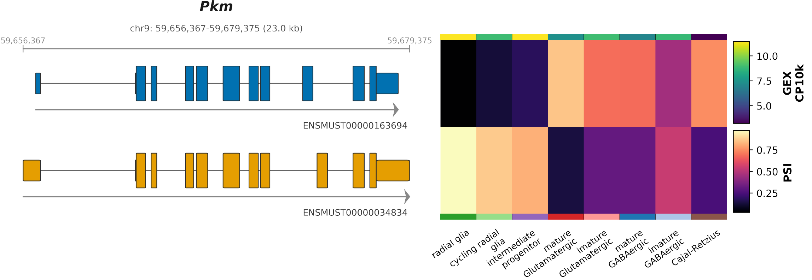
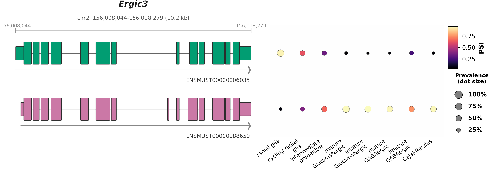
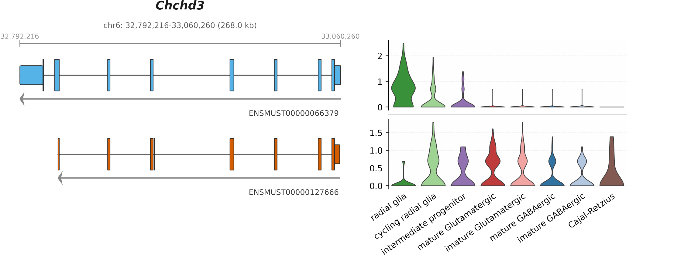
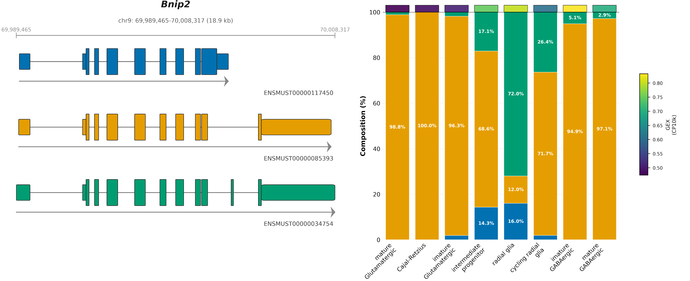
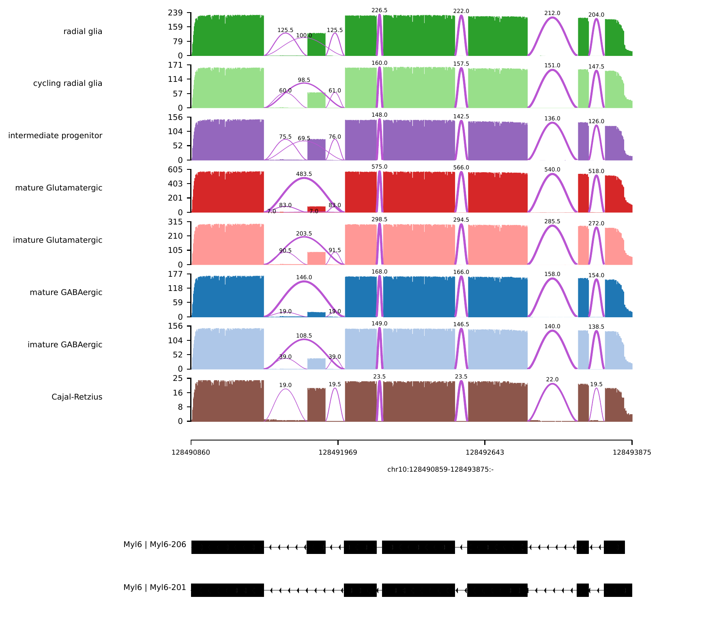

<p align="center">
  
</p>

<h2 align="center">An integrated Python toolkit for isoform-level single-cell and spatial transcriptomics</h2>

<p align="center">
  <a href="https://opensource.org/licenses/Apache-2.0"></a>
  <a href="https://pypi.org/project/allos/"></a>
  <a href="https://github.com/cobioda/allos/actions/workflows/deploy.yaml"></a>
  <a href="https://colab.research.google.com/github/cobioda/allos/blob/main/nbs/index.ipynb"></a>
</p>

---

Most single-cell and spatial transcriptomics pipelines collapse transcript diversity into a single count per gene, obscuring alternative splicing and isoform usage. As long-read sequencing now routinely recovers full-length transcripts from single cells and spatially barcoded tissues, **Allos** provides the computational framework to analyse them.

Allos is a Python toolkit built natively around [AnnData](https://anndata.readthedocs.io) and the [scverse](https://scverse.org) ecosystem. It provides a complete end-to-end environment for isoform-resolved analysis — from QC and preprocessing through differential isoform usage screening, to structure-aware visualisation, coverage-based validation, and protein-level interpretation — across both single-cell and spatial data.

---

## SwitchSearch — transcriptome-wide isoform switch screening

`SwitchSearch` screens every gene with ≥2 expressed isoforms across all pairwise cell-type contrasts simultaneously, using a χ² contingency test on isoform count vectors. Results are ranked by adjusted p-value and an optional Δπ effect size — the summed magnitude of PSI change across the two most strongly shifting isoforms — giving an immediate ranked list of candidate switches for downstream inspection.

The screen completes in **~34 seconds** on a typical single-cell dataset, making it practical as a first-pass discovery step before committing to more computationally intensive pseudobulk methods.

<p align="center">
  
  <br/>
  <em>Representative pairwise SwitchSearch contrasts — E18 mouse brain. Highlighted genes (|Δπ| ≥ 0.15, orange) include well-characterised switches such as <em>Pkm</em>, <em>Clta</em>, <em>Myl6</em>, and <em>Ergic3</em>, alongside novel candidates.</em>
</p>

Each significant hit can be passed directly to a composed plot for structural and quantitative interpretation — no intermediate steps required.

---

## Composed plots — transcript structure meets quantification

The centrepiece of Allos is the **composed plot**: transcript structures rendered to genomic scale, aligned directly with quantitative isoform usage panels. Three formats are available to match different expression patterns and data densities.

**Heatmap format** — best for genes with strong, consistent switching across many groups. Summarises mean PSI simultaneously for all cell types. The upper gene expression track confirms whether isoform differences reflect splicing shifts or differential gene expression.

<p align="center">
  
  <br/>
  <em>Pkm — the canonical M1/M2 isoform switch during neuronal maturation, showing a clear progenitor-to-neuron transition in splicing preference.</em>
</p>

**Dotplot format** — encodes mean PSI as colour and prevalence (% of cells expressing the isoform) as dot size, distinguishing widespread isoform shifts from those driven by a small number of highly expressing cells.

<p align="center">
  
  <br/>
  <em>Ergic3 — a clear developmental pattern: the exon-excluding isoform dominates in radial glia, while the exon-including isoform prevails across neuronal populations.</em>
</p>

**Violin format** — shows the full per-cell expression distribution, capturing cell-type-restricted isoform specificity even at low expression levels where summary statistics would miss the signal.

<p align="center">
  
  <br/>
  <em>Chchd3 — the exon-excluding isoform shows strikingly radial-glia-specific expression, largely absent across all other cell types.</em>
</p>

**Stacked bar format** — displays isoform proportions as stacked bars per group, giving an immediate overview of relative isoform usage across the full complement of expressed transcripts.

<p align="center">
  
  <br/>
  <em>Bnip2 — isoform composition shifts markedly across the developmental hierarchy, with the dominant transcript switching between progenitor and neuronal populations.</em>
</p>

---

## Coverage plots — read-level validation

Coverage plots provide an orthogonal layer of validation for candidate switches, displaying mean read depth and splice junction usage per cell type alongside reference transcript models — a genome-browser–style view without leaving Python.

<p align="center">
  
  <br/>
  <em>Myl6 — exon inclusion is high in radial glia (clear junction support for Myl6-206) and progressively decreases through the developmental hierarchy, confirming the isoform switch at read level.</em>
</p>

---

## Spatial isoform resolution

Allos visualises isoform usage directly on tissue coordinates, combining transcript structure diagrams with KDE-smoothed density maps or per-spot expression plots across spatially barcoded long-read datasets.

<p align="center">
  
  <br/>
  <em>Three Clta isoforms with transcript structures and KDE-smoothed spatial density — mouse coronal brain section (SiT dataset).</em>
</p>

---

## Features

**Data & Platforms**
- Supports transcript × cell or spot count matrices from **Oxford Nanopore**, **PacBio**, **Smart-seq2**, **Illumina**, and spatial long-read platforms (e.g. Visium + ONT)
- Integrates GTF/GFF and transcript FASTA annotations via the `TranscriptData` module
- Fully compatible with Scanpy, Seurat-derived annotations, and the broader scverse ecosystem

**Analysis**
- **SwitchSearch** — χ²-based DIU screen across all pairwise or one-vs-rest contrasts; completes in ~34 s vs. 1.8 min (DiffSplice) and 4.9 min (DEXSeq)
- **Pseudobulk DIU** — replicate-aware testing via [edgePython](https://github.com/pachterlab/edgePython) + DiffSplice for rigorous follow-up
- **SPLISOSM integration** — direct export for spatial isoform testing
- Isoform proportion estimation with pseudobulk, Dirichlet-smoothed, or per-cell estimators; ΔPSI and Δπ effect sizes

**Visualisation**
- **Composed plots** — seven formats: heatmap, dotplot, violin, stacked bar, UMAP, density, and replicate concordance — each pairing transcript structures with quantitative panels
- **Coverage plots** — read depth and splice junction tracks stratified by cell type or condition
- **Coordinate plots** — UMAP or spatial tissue overlays; KDE-smoothed density maps for sparse data
- **Protein domain overlay** — Ensembl/InterPro domain annotations mapped onto transcript exon structures with linearised protein tracks
- **Volcano plots** — manuscript-quality Δπ-vs-FDR panels with adjustText labels, rasterised scatter, and grid tiling
- **QC plots** — isoform-per-gene distributions, transcript lengths, biotype breakdowns

**Interactive Dashboard**
- Streamlit-based GUI for code-free isoform exploration; export in PNG, PDF, or SVG at publication resolution

---

## Installation

```sh
git clone https://github.com/cobioda/allos
cd allos
pip install -e .
```

---

## Quick Start

Allos ships with a bundled E18 mouse brain dataset (1,109 cells × 31,986 transcripts).

```python
import allos.preprocessing as pp
from allos.switch_search import SwitchSearch, volcano_grid
from allos.transcript_data import TranscriptData
from allos.composed_plots import (
    plot_isoform_heatmap_composed,
    plot_isoform_dot_composed,
    plot_isoform_violin_composed,
    plot_isoform_stacked_bar_composed,
)
from allos.coverage_plots import plot_gene_coverage
import scanpy as sc

# 1. Load bundled test data
adata = pp.process_mouse_data()
td = TranscriptData("Mus_musculus.GRCm39.109.gtf.gz")
adata = pp.filter_transcripts_by_abundance(adata, threshold_pct=2)

# 2. Screen for differential isoform usage across all cell-type pairs (~34 seconds)
ss = SwitchSearch(adata, n_jobs=8)
results = ss.find_switches_chi2(primary_col="cell_type", fdr=0.10)

# 3. Volcano grid — overview of switches across maturation contrasts
volcano_grid(results, n_cols=4, eff_cutoff=0.15, fdr_cutoff=0.05)

# 4. Composed heatmap — transcript structures + PSI heatmap in one figure
plot_isoform_heatmap_composed(
    transcript_data=td, adata=adata, gene_id="Pkm",
    group_col="cell_type", top_n=3, add_gex_band=True,
)

# 5. Composed dotplot — isoform prevalence and PSI per cell type
plot_isoform_dot_composed(
    transcript_data=td, adata=adata, gene_id="Ergic3",
    group_col="cell_type", top_n=3,
)

# 6. Composed violin — full per-cell expression distributions
plot_isoform_violin_composed(
    transcript_data=td, adata=adata, gene_id="Chchd3",
    group_col="cell_type", top_n=3,
)

# 7. Coverage plot — read depth and splice junctions from BAM files
plot_gene_coverage(
    adata, transcript_data=td, gene="Myl6",
    groupby="cell_type", bam_paths=bam_paths,
    bam_column="batch", gtf_file="annotation.gtf.gz",
)
```

---

## SwitchSearch performance

<p align="center">
  
</p>

SwitchSearch is designed as a rapid first-pass exploratory screen — analogous to marker gene detection in Scanpy — and is complemented by pseudobulk methods (DiffSplice via edgePython, DEXSeq) for rigorous confirmatory analysis, both accessible within Allos.

---

## Modules

| Module | Description |
|---|---|
| `allos.preprocessing` | Load data, QC, normalize, transfer annotations, collapse transcripts → genes |
| `allos.switch_search` | `SwitchSearch` — χ²-based DIU screening; volcano plots; ΔPSI and Δπ effect sizes |
| `allos.transcript_data` | `TranscriptData` — GTF/GFF parsing, exon/CDS retrieval, sequence extraction |
| `allos.transcript_plots` | `TranscriptPlots` — transcript structure glyphs with intron compression |
| `allos.composed_plots` | Seven composed plot types (heatmap, dotplot, violin, stacked bar, UMAP, density, replicates) |
| `allos.coverage_plots` | Per-cell-type BAM coverage with splice junction arcs |
| `allos.protein_data` | Ensembl/InterPro domain retrieval and AA→genomic mapping |
| `allos.protein_plots` | Linearised protein track overlay on transcript structures |
| `allos.visuals` | UMAP/spatial overlays, KDE density maps |
| `allos.color_palette` | Curated colour palettes for publication figures |

---

## Documentation

Full API reference and worked tutorials at [cobioda.github.io/allos](https://cobioda.github.io/allos/).

| Notebook | Description |
|---|---|
| [Transcript Plots](https://cobioda.github.io/allos/001_transcript_plots.html) | Composed plots and transcript structure drawing |
| [Transcript Data](https://cobioda.github.io/allos/002_transcript_data.html) | Working with transcript-level AnnData objects |
| [Isoform Switch Search](https://cobioda.github.io/allos/005_switch_search.html) | DIU detection with `SwitchSearch` |
| [Preprocessing](https://cobioda.github.io/allos/007_preprocesing.html) | Normalization, filtering, and gene collapse |
| [Visuals](https://cobioda.github.io/allos/008_visuals.html) | Full plotting API reference |

---

## Citation

If you use Allos in your research, please cite:

> McAndrew E., Diamant A., Barbry P., Vassaux G., Lebrigand K. (2026).
> **Allos: an integrated Python toolkit for isoform-level single-cell and spatial in-situ transcriptomics.**
> [bioRxiv 10.64898/2026.03.24.713944](https://www.biorxiv.org/content/10.64898/2026.03.24.713944v1)

---

## Contributing

Contributions are welcome — open an issue before submitting a pull request. Allos is built with [nbdev](https://nbdev.fast.ai); all source edits belong in `nbs/`, not in generated `.py` files.

```sh
git clone https://github.com/cobioda/allos
cd allos
pip install -e '.[dev]'
nbdev_install_hooks
```

---

## License

Released under the [Apache 2.0 License](https://opensource.org/licenses/Apache-2.0). © 2024 Anna Diamant, Eamon McAndrew, Université Côte d'Azur.
