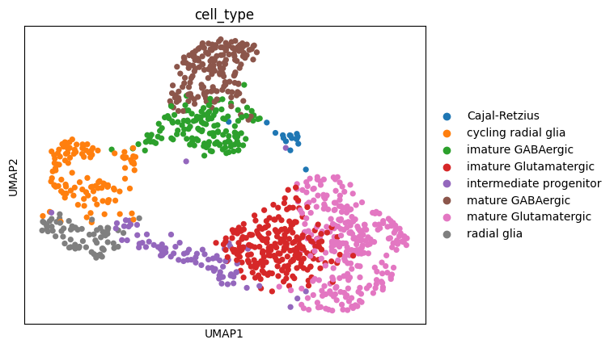
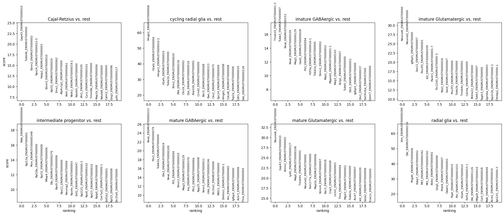
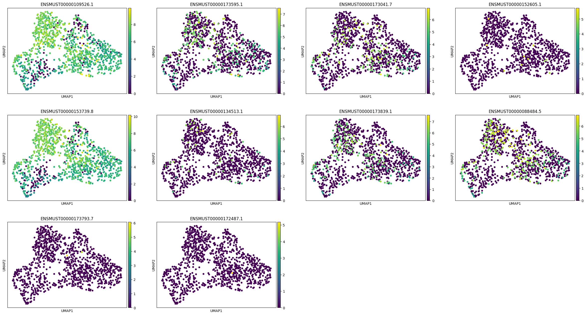
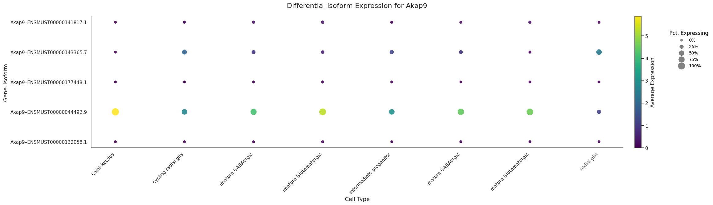

# Allos


<!-- WARNING: THIS FILE WAS AUTOGENERATED! DO NOT EDIT! -->


[](https://opensource.org/licenses/Apache-2.0)[](https://github.com/a-diamant/allos/actions/workflows/deploy.yaml)
[](https://github.com/a-diamant/allos/actions/workflows/pages/pages-build-deployment)<a target="_blank" href="https://colab.research.google.com/github/a-diamant/allos/blob/develop/nbs/index.ipynb">

</a>

Single-cell RNA sequencing (scRNA-seq) has revolutionized our
understanding of cellular diversity by allowing the study of gene
expression at the individual cell level. However, traditional methods of
quantification obscure the most fine-grained transcriptional layer—the
individual transcripts at sequence-level resolution—in favor of
gene-level binning. This strategy is useful when the sequencing read
length is short, as it avoids the difficult task of transcript assembly,
which is made even more challenging by the nature of single-cell data.

Traditional scRNA-seq methods often rely on short-read sequencing
technologies, which can limit the ability to resolve full-length
transcripts and isoforms. Long-read sequencing technologies, such as
those provided by Oxford Nanopore and PacBio, overcome this limitation
by producing reads that span entire transcripts. This capability is
crucial for accurately identifying and characterizing novel isoforms and
understanding the complexity of transcriptomes in single cells. By
integrating long-read sequencing with single-cell approaches,
researchers can gain deeper insights into cellular heterogeneity and the
functional implications of transcriptomic variations.

Allos is designed to give users familiar with single-cell analysis, and
indeed object-oriented programming in general, an extended toolkit
wrapping around Scanpy and the wider scverse to facilitate analysis
workflows of this type of data. Allos is the culmination of many smaller
individualized scripts packaged together into a common framework
centered on anndata objects. It also contains many recreations (of
varying faithfulness to their originals\*) of functions proposed by
others in other libraries, languages, or contexts—we by no means intend
to plagiarize these methods but only expand them to a wider audience.

Allos intends to offer a full suite of modules for every step of
single-cell isoform resolution data, from preprocessing, working with
annotations, plotting, identifying differential features, isoform
switches, and more. We hope to expand Allos with the input of our user
base as the field of long-read single-cell further matures.

## Install

``` sh
pip install allos
```

## Basic workflow

The first thing we need to work with Allos is data. Our goal is for
Allos to handle many, if not all, types of single-cell isoform
resolution data, making it platform and protocol agnostic. While it is
important to consider the biases, strengths, limitations, and caveats of
each approach, all methods utilize a transcript matrix from which a gene
matrix can be derived. Allos also allows users to supply their own
custom annotations in the form of a GTF or use a reference annotation.
If a reference annotation is provided, all plotting functions will use
the underlying GTF to retrieve the transcript information.

To help you follow the basic workflow, we provide an easy way to
download one of our test datasets. The Sicelore dataset comprises 1,121
single-cell transcriptomes from two technical replicates derived from an
embryonic day 18 (E18) mouse brain, consisting of 951 cells and 190
cells. The dataset was generated using the 10x Genomics Chromium system
and sequenced with both Oxford Nanopore and Illumina platforms,
producing 322 million Nanopore reads and 70 million Illumina reads for
the 951-cell replicate, and 32 million Nanopore reads with 43 million
Illumina reads for the 190-cell replicate. The dataset captured a median
of 2,427 genes and 6,047 UMIs per cell, enabling the identification of
33,002 annotated transcript isoforms and 4,388 novel isoforms. Major
cell types in the dataset include radial glia, cycling radial glia,
intermediate progenitors, Cajal-Retzius cells, and maturing GABAergic
and glutamatergic neurons, providing a detailed resource for studying
transcriptome-wide alternative splicing, isoform expression, and
sequence diversity during mouse brain development.

``` python
import allos.preprocessing as pp
sicelore_mouse_data = pp.process_mouse_data()
```


    🔎 Looking for file at: /data/analysis/data_mcandrew/Allos_new/allos_env/lib/python3.9/site-packages/allos/resources/e18.mouse.clusters.csv
    ✅ File found at: /data/analysis/data_mcandrew/Allos_new/allos_env/lib/python3.9/site-packages/allos/resources/e18.mouse.clusters.csv
    ✅ File already exists at: /data/analysis/data_mcandrew/Allos_new/allos_env/lib/python3.9/site-packages/allos/resources/data/mouse_1.txt.gz

    🔄 Decompressing /data/analysis/data_mcandrew/Allos_new/allos_env/lib/python3.9/site-packages/allos/resources/data/mouse_1.txt.gz to /data/analysis/data_mcandrew/Allos_new/allos_env/lib/python3.9/site-packages/allos/resources/data/mouse_1.txt...
    ✅ Decompression complete.
    Test data (mouse_1) downloaded successfully
    ✅ File already exists at: /data/analysis/data_mcandrew/Allos_new/allos_env/lib/python3.9/site-packages/allos/resources/data/mouse_2.txt.gz

    🔄 Decompressing /data/analysis/data_mcandrew/Allos_new/allos_env/lib/python3.9/site-packages/allos/resources/data/mouse_2.txt.gz to /data/analysis/data_mcandrew/Allos_new/allos_env/lib/python3.9/site-packages/allos/resources/data/mouse_2.txt...
    ✅ Decompression complete.
    Test data (mouse_2) downloaded successfully

    /data/analysis/data_mcandrew/Allos_new/allos_env/lib/python3.9/site-packages/anndata/_core/anndata.py:1754: UserWarning: Observation names are not unique. To make them unique, call `.obs_names_make_unique`.
      utils.warn_names_duplicates("obs")

In this dataset, we observe the mouse data organized in a
cell-by-transcript matrix format. This structure allows us to examine
the expression levels of individual transcripts across different cells.
Additionally, each transcript is associated with a specific gene,
providing a hierarchical view of gene expression. This organization is
crucial for understanding the relationship between transcripts and their
corresponding genes.

``` python
sicelore_mouse_data
```

    View of AnnData object with n_obs × n_vars = 1109 × 31986
        obs: 'batch', 'cell_type'
        var: 'geneId'

``` python
print(sicelore_mouse_data.var.head(10))
```

                           geneId
    transcriptId                 
    ENSMUST00000156717.1     Klc2
    ENSMUST00000212520.1   Capn15
    ENSMUST00000025798.12    Klc2
    ENSMUST00000231280.1    Eva1c
    ENSMUST00000039286.4     Atg5
    ENSMUST00000144552.7   Znhit3
    ENSMUST00000112304.8    Ppm1b
    ENSMUST00000162041.7     Gcc2
    ENSMUST00000053506.6     Bbs1
    ENSMUST00000028207.12    Crat

IsoAdata objects are fully compatible with standard AnnData objects. We
can use them just like any conventional AnnData instance. Let’s take a
closer look at how they function.

``` python
import scanpy as sc

# Make a copy of the original data to preserve it
original_sicelore_mouse_data = sicelore_mouse_data.copy()

# Perform the operations
sc.pp.normalize_total(sicelore_mouse_data, target_sum=1e6)
sc.pp.log1p(sicelore_mouse_data)

# Select the top 5000 highly variable genes
sc.pp.highly_variable_genes(sicelore_mouse_data, n_top_genes=5000)
sicelore_mouse_data = sicelore_mouse_data[:, sicelore_mouse_data.var.highly_variable]

sc.pp.neighbors(sicelore_mouse_data)
sc.tl.umap(sicelore_mouse_data)
sc.pl.umap(sicelore_mouse_data, color='cell_type')

# Restore the original data
sicelore_mouse_data = original_sicelore_mouse_data
```

    /data/analysis/data_mcandrew/Allos_new/allos_env/lib/python3.9/site-packages/scanpy/preprocessing/_normalization.py:207: UserWarning: Received a view of an AnnData. Making a copy.
      view_to_actual(adata)
    /data/analysis/data_mcandrew/Allos_new/allos_env/lib/python3.9/site-packages/scanpy/tools/_utils.py:41: UserWarning: You’re trying to run this on 5000 dimensions of `.X`, if you really want this, set `use_rep='X'`.
             Falling back to preprocessing with `sc.pp.pca` and default params.
      warnings.warn(
    /data/analysis/data_mcandrew/Allos_new/allos_env/lib/python3.9/site-packages/tqdm/auto.py:21: TqdmWarning: IProgress not found. Please update jupyter and ipywidgets. See https://ipywidgets.readthedocs.io/en/stable/user_install.html
      from .autonotebook import tqdm as notebook_tqdm


We can easily collapse the transcript matrix to a gene matrix and see
how the dimensionality reduction plot differs.

``` python
import allos.preprocessing as pp

gene_anndata = pp.get_sot_gene_matrix(sicelore_mouse_data)

# Make a copy of the gene matrix data to preserve it
original_gene_anndata = gene_anndata.copy()

# Perform the operations on the gene matrix
sc.pp.normalize_total(gene_anndata, target_sum=1e6)
sc.pp.log1p(gene_anndata)

# Select the top 5000 highly variable genes for gene_anndata
sc.pp.highly_variable_genes(gene_anndata, n_top_genes=5000)
gene_anndata = gene_anndata[:, gene_anndata.var.highly_variable]

sc.pp.neighbors(gene_anndata)
sc.tl.umap(gene_anndata)
sc.pl.umap(gene_anndata, color='cell_type')

# Restore the original gene matrix data
gene_anndata = original_gene_anndata
```

    /data/analysis/data_mcandrew/Allos_new/allos_env/lib/python3.9/site-packages/scanpy/tools/_utils.py:41: UserWarning: You’re trying to run this on 5002 dimensions of `.X`, if you really want this, set `use_rep='X'`.
             Falling back to preprocessing with `sc.pp.pca` and default params.
      warnings.warn(



Let’s examine the most differentially expressed genes across the
pre-annotated cell types.

``` python
# Perform differential expression analysis to rank genes on the gene matrix
sc.tl.rank_genes_groups(gene_anndata, 'cell_type', method='t-test')

# Plot the ranked gene groups with adjusted figure size
sc.pl.rank_genes_groups(gene_anndata, n_genes=20, sharey=False, figsize=(12, 10))
```

    WARNING: It seems you use rank_genes_groups on the raw count data. Please logarithmize your data before calling rank_genes_groups.


Now, let’s examine the differentially expressed transcripts. Unlike our
previous focus on genes, we will shift our attention to the transcript
level. The finest resoloution transcriptional layer. We should still see
considerable gene wise overlap in the two rankings as we would expect in
many cases the higher gene count to be driven by a single isoform.

``` python
# Concatenate the gene name before the transcript ID in the transcript matrix
transcript_matrix = sicelore_mouse_data.copy()

# Convert 'geneId' to string to avoid TypeError when concatenating with index
transcript_matrix.var['geneId'] = transcript_matrix.var['geneId'].astype(str)

# Assuming 'gene_name' and 'transcript_id' are columns in the var DataFrame of the AnnData object
transcript_matrix.var['gene_transcript_id'] = transcript_matrix.var['geneId'] + '_' + transcript_matrix.var.index.astype(str)

# Truncate the gene_transcript_id to fit better in plots
transcript_matrix.var['gene_transcript_id'] = transcript_matrix.var['gene_transcript_id'].str.slice(0, 20)

# Update the var index to use the new truncated gene_transcript_id
transcript_matrix.var.index = transcript_matrix.var['gene_transcript_id']

# Log transform and CPM normalize the transcript matrix
sc.pp.normalize_total(transcript_matrix, target_sum=1e6)
sc.pp.log1p(transcript_matrix)

# Perform differential expression analysis to rank genes on the transcript matrix
sc.tl.rank_genes_groups(transcript_matrix, 'cell_type', method='t-test')

# Plot the ranked gene groups with adjusted figure size
sc.pl.rank_genes_groups(transcript_matrix, n_genes=20, sharey=False, figsize=(12, 10))
```



Lets visualise the isoforms of a specific gene Nnat based on multiple
transcripts from this gene in the top rankings of imature GABAergic vs
rest.

``` python
# Perform the operations on a copy of the sicelore_mouse_data
sicelore_mouse_data_copy = sicelore_mouse_data.copy()

sc.pp.normalize_total(sicelore_mouse_data_copy, target_sum=1e6)
sc.pp.log1p(sicelore_mouse_data_copy)

sc.pp.neighbors(sicelore_mouse_data_copy)
sc.tl.umap(sicelore_mouse_data_copy)
```

    /data/analysis/data_mcandrew/Allos_new/allos_env/lib/python3.9/site-packages/scanpy/tools/_utils.py:41: UserWarning: You’re trying to run this on 31986 dimensions of `.X`, if you really want this, set `use_rep='X'`.
             Falling back to preprocessing with `sc.pp.pca` and default params.
      warnings.warn(

``` python
import allos.visuals as vs
vs.plot_transcripts(sicelore_mouse_data_copy, gene_id='Nnat')
```



``` python
import allos.visuals as vs
vs.plot_transcripts(sicelore_mouse_data_copy, gene_id='Pkm')
```


``` python
from allos.switch_search import SwitchSearch
```

``` python
ss = SwitchSearch(sicelore_mouse_data)
```

``` python
switch_list = ss.find_switching_isoforms_wilcoxon(n_jobs=10)
```

``` python
switch_list.head(20)
```

<div>
<style scoped>
    .dataframe tbody tr th:only-of-type {
        vertical-align: middle;
    }
&#10;    .dataframe tbody tr th {
        vertical-align: top;
    }
&#10;    .dataframe thead th {
        text-align: right;
    }
</style>

|  | transcript_id | scores | log_fold_change | pvals | pvals_adj | group_1 | group_2 | contrast | gene_id | n_cells_group_1 | n_cells_group_2 | total_cells | p_value | direction | percent_expressed_group_1 | percent_expressed_group_2 |
|----|----|----|----|----|----|----|----|----|----|----|----|----|----|----|----|----|
| 5943 | ENSMUST00000034834.15 | 12.270655 | 5.354527 | 1.301969e-34 | 1.156799e-31 | cycling radial glia | mature Glutamatergic | cycling radial glia\_\_mature Glutamatergic | Pkm | 117 | 275 | 392 | 7.113057e-29 | 5.354527 | 88.888889 | 42.181818 |
| 5944 | ENSMUST00000163694.3 | 11.957458 | 5.027552 | 5.935075e-33 | 4.630227e-30 | mature Glutamatergic | cycling radial glia | cycling radial glia\_\_mature Glutamatergic | Pkm | 275 | 117 | 392 | 2.160587e-27 | -5.027552 | 89.818182 | 43.589744 |
| 5959 | ENSMUST00000034834.15 | 11.984186 | 5.965338 | 4.300464e-33 | 2.751093e-29 | intermediate progenitor | mature Glutamatergic | intermediate progenitor\_\_mature Glutamatergic | Pkm | 86 | 275 | 361 | 1.154418e-26 | 5.965338 | 94.186047 | 42.181818 |
| 1486 | ENSMUST00000107849.9 | 11.684690 | 5.028407 | 1.526343e-31 | 1.038757e-28 | mature Glutamatergic | cycling radial glia | cycling radial glia\_\_mature Glutamatergic | Clta | 275 | 117 | 392 | 3.982160e-26 | -5.028407 | 87.636364 | 39.316239 |
| 5966 | ENSMUST00000034834.15 | 11.383351 | 6.386945 | 5.061634e-30 | 5.996349e-27 | radial glia | mature Glutamatergic | mature Glutamatergic\_\_radial glia | Pkm | 68 | 275 | 343 | 1.591441e-24 | -6.386945 | 95.588235 | 42.181818 |
| 5965 | ENSMUST00000163694.3 | 11.155944 | 8.147258 | 6.697808e-29 | 6.121031e-26 | mature Glutamatergic | radial glia | mature Glutamatergic\_\_radial glia | Pkm | 275 | 68 | 343 | 1.333826e-23 | 8.147258 | 89.818182 | 16.176471 |
| 1506 | ENSMUST00000107849.9 | 10.725714 | 8.949328 | 7.708972e-27 | 5.360417e-24 | mature Glutamatergic | radial glia | mature Glutamatergic\_\_radial glia | Clta | 275 | 68 | 343 | 9.377558e-22 | 8.949328 | 87.636364 | 7.352941 |
| 2235 | ENSMUST00000154584.8 | 10.596644 | 6.462344 | 3.088641e-26 | 1.975866e-23 | radial glia | mature Glutamatergic | mature Glutamatergic\_\_radial glia | Eef1d | 68 | 275 | 343 | 3.237709e-21 | -6.462344 | 89.705882 | 24.727273 |
| 5940 | ENSMUST00000163694.3 | 10.560711 | 4.567454 | 4.532153e-26 | 3.221454e-23 | imature Glutamatergic | cycling radial glia | cycling radial glia\_\_imature Glutamatergic | Pkm | 234 | 117 | 351 | 5.183036e-21 | -4.567454 | 84.615385 | 43.589744 |
| 1130 | ENSMUST00000030417.9 | 10.449820 | 7.487224 | 1.468039e-25 | 8.695686e-23 | mature Glutamatergic | radial glia | mature Glutamatergic\_\_radial glia | Cdc42 | 275 | 68 | 343 | 1.304437e-20 | 7.487224 | 85.090909 | 14.705882 |
| 1118 | ENSMUST00000030417.9 | 10.378815 | 4.576591 | 3.095947e-25 | 1.112662e-22 | mature Glutamatergic | cycling radial glia | cycling radial glia\_\_mature Glutamatergic | Cdc42 | 275 | 117 | 392 | 1.657093e-20 | -4.576591 | 85.090909 | 39.316239 |
| 5955 | ENSMUST00000163694.3 | 10.207308 | 7.687160 | 1.838968e-24 | 1.307138e-21 | imature Glutamatergic | radial glia | imature Glutamatergic\_\_radial glia | Pkm | 234 | 68 | 302 | 1.694750e-19 | 7.687160 | 84.615385 | 16.176471 |
| 1484 | ENSMUST00000107849.9 | 10.054152 | 4.796204 | 8.807723e-24 | 6.871313e-21 | mature GABAergic | cycling radial glia | cycling radial glia\_\_mature GABAergic | Clta | 172 | 117 | 289 | 8.006304e-19 | -4.796204 | 83.139535 | 39.316239 |
| 1482 | ENSMUST00000107849.9 | 9.975988 | 4.470673 | 1.941579e-23 | 9.857674e-21 | imature Glutamatergic | cycling radial glia | cycling radial glia\_\_imature Glutamatergic | Clta | 234 | 117 | 351 | 1.127442e-18 | -4.470673 | 83.760684 | 39.316239 |
| 1497 | ENSMUST00000107849.9 | 9.958041 | 8.391595 | 2.326005e-23 | 1.458816e-20 | imature Glutamatergic | radial glia | imature Glutamatergic\_\_radial glia | Clta | 234 | 68 | 302 | 1.632402e-18 | 8.391595 | 83.760684 | 7.352941 |
| 182 | ENSMUST00000044492.9 | 9.737172 | 6.676501 | 2.092979e-22 | 1.239741e-19 | imature Glutamatergic | radial glia | imature Glutamatergic\_\_radial glia | Akap9 | 234 | 68 | 302 | 1.251917e-17 | 6.676501 | 83.760684 | 22.058824 |
| 1504 | ENSMUST00000107849.9 | 9.634603 | 8.717126 | 5.711261e-22 | 3.653608e-19 | mature GABAergic | radial glia | mature GABAergic\_\_radial glia | Clta | 172 | 68 | 240 | 3.464178e-17 | 8.717126 | 83.139535 | 7.352941 |
| 5964 | ENSMUST00000034834.15 | 9.557229 | 5.815203 | 1.209522e-21 | 7.439957e-19 | radial glia | mature GABAergic | mature GABAergic\_\_radial glia | Pkm | 68 | 172 | 240 | 6.804876e-17 | -5.815203 | 95.588235 | 43.023256 |
| 1485 | ENSMUST00000170241.7 | 9.399286 | 3.665712 | 5.493450e-21 | 1.417044e-18 | cycling radial glia | mature Glutamatergic | cycling radial glia\_\_mature Glutamatergic | Clta | 117 | 275 | 392 | 1.266246e-16 | 3.665712 | 83.760684 | 47.636364 |
| 1507 | ENSMUST00000170241.7 | 9.359902 | 4.369593 | 7.981022e-21 | 3.191012e-18 | radial glia | mature Glutamatergic | mature Glutamatergic\_\_radial glia | Clta | 68 | 275 | 343 | 2.733443e-16 | -4.369593 | 89.705882 | 47.636364 |

</div>

``` python
vs.plot_transcript_exspression_dotplot(sicelore_mouse_data_copy, gene_id='Clta')
```


``` python
vs.plot_transcript_expression_violin(sicelore_mouse_data_copy, gene_id='Clta')
```


Let’s explore these transcripts of interest by visualizing them using
the method described below. We will instantiate our transcript plot
objects with the appropriate GTF file. For demonstration purposes, we
provide the code to download the GTF file used in this dataset. This
process will help us better understand the structure of the transcripts
involved in this Isoform switch. Please ensure that you have a stable
internet connection to download the GTF file if it’s not already
available locally.

``` python
from allos.transcript_plots import TranscriptPlots
import os
import urllib.request
from pathlib import Path

# Example Ensembl URLs for mouse GRCm39 (release 109)
gtf_url = "ftp://ftp.ensembl.org/pub/release-109/gtf/mus_musculus/Mus_musculus.GRCm39.109.gtf.gz"

# Store data one directory back
data_dir = Path("..") / "data"
data_dir.mkdir(parents=True, exist_ok=True)

gtf_file_local = data_dir / "Mus_musculus.GRCm39.109.gtf.gz"

# Download if not already present
if not gtf_file_local.is_file():
    print(f"Downloading {gtf_url}...")
    urllib.request.urlretrieve(gtf_url, gtf_file_local)


tp = TranscriptPlots(gtf_file= gtf_file_local)
```

``` python
from allos.switch_search import get_top_n_isoforms
top_n = get_top_n_isoforms(sicelore_mouse_data_copy, gene_id='Clta', strip=True)
tp.draw_transcripts_list(top_n, draw_cds=True)
```


To focus on the top three most expressed isoforms in the dataset, we can
filter and visualize them using the following approach. This allows us
to concentrate on the most significant isoforms for further analysis or
presentation, useful as some genes have a lot of isoforms and many are
very lowly exspressed.

``` python
from allos.switch_search import get_top_n_isoforms
top_n = get_top_n_isoforms(sicelore_mouse_data_copy, gene_id='Clta', strip=True, top_n=3)
tp.draw_transcripts_list(top_n, draw_cds=True)
```


Now, let’s visualize the top isoforms using a dimensionality reduction
technique. In this case, we will utilize UMAP for the plot.

``` python
top_n = get_top_n_isoforms(sicelore_mouse_data_copy, gene_id='Clta', strip=False, top_n=3)

vs.plot_transcripts(sicelore_mouse_data_copy, transcripts=top_n)
```


To gain a deeper understanding of how isoforms structurally differ
across various cell types, we can analyze the inclusion of different
exons in the final transcript structure. A useful metric for this
analysis is the Percent Spliced In (PSI) value, which quantifies the
proportion of transcripts that include a particular exon. By calculating
the PSI for each exon, we can identify and compare the structural
variations of isoforms between cell types, providing insights into their
functional implications and regulatory mechanisms. This approach allows
us to pinpoint specific exons that contribute to the diversity of
isoform expression and understand their role in cellular differentiation
and function.

``` python
tp.compare_two_celltypes_psi(adata=sicelore_mouse_data, gene_name='Clta', label_column='cell_type', group1='imature Glutamatergic', group2= 'radial glia', celltype1_label='imature Glutamatergic', celltype2_label='Radial Glia')
```


Let’s explore another potential isoform switch event.

``` python
vs.plot_transcript_exspression_dotplot(sicelore_mouse_data_copy, gene_id='Akap9')
```


``` python
top_n = get_top_n_isoforms(sicelore_mouse_data_copy, gene_id='Akap9', strip=True)
tp.draw_transcripts_list(top_n, draw_cds=True)
```

    WARNING:root:No CDS features found for transcript ENSMUST00000141817.
    WARNING:root:No CDS features found for transcript ENSMUST00000177448.
    WARNING:root:No CDS features found for transcript ENSMUST00000132058.


``` python
top_n = get_top_n_isoforms(sicelore_mouse_data_copy, gene_id='Akap9', strip=True, top_n=2)
tp.draw_transcripts_list(top_n, draw_cds=True)
```


``` python
top_n = get_top_n_isoforms(sicelore_mouse_data_copy, gene_id='Akap9', strip=False, top_n=2)

vs.plot_transcripts(sicelore_mouse_data_copy, transcripts=top_n)
```


The visualization of cell features, such as genes and peaks, is often
challenged by sparsity and technical dropout. These factors can obscure
the clarity of visualizations, particularly when combined with
clustering techniques used to annotate cell types. To enhance the
visibility of patterns within the data, kernel density estimation (KDE)
can be employed. KDE helps to highlight underlying trends by smoothing
the data, making patterns more pronounced. However, it is crucial to use
KDE alongside the actual count data to avoid potential
misinterpretations. Relying solely on KDE without considering the raw
counts can lead to misleading conclusions, as it may exaggerate or
obscure the true distribution of features. Therefore, a balanced
approach that integrates both KDE and raw data visualization is
recommended for accurate interpretation.

``` python
vs.plot_density_multi(sicelore_mouse_data_copy, features=top_n)
```



``` python
tp.compare_two_celltypes_psi(adata=sicelore_mouse_data, gene_name='Akap9', label_column='cell_type', group1='imature Glutamatergic', group2= 'radial glia', celltype1_label='imature Glutamatergic', celltype2_label='Radial Glia')
```


